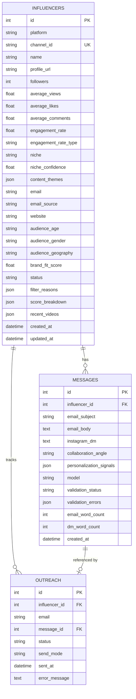

# EDXSO Automated Micro-Influencer Outreach System

> **Production-Grade Micro-Influencer Discovery, Niche Classification, Brand-Fit Scoring, Groq LLM Personalization, and Safe Outreach Simulation Engine.**

---

## 1. Project Overview

The **EDXSO Automated Micro-Influencer Outreach System** is an end-to-end backend platform designed to discover, evaluate, enrich, and reach out to real technology micro-influencers (*5,000 to 100,000 subscribers*). 

Built with **Python 3.11+**, the **YouTube Data API v3**, the **Groq API**, **SQLite/SQLAlchemy**, and **Pydantic**, this system solves the challenge of influencer discovery and hyper-personalized outreach at scale while strictly adhering to real-data integrity, zero hallucination, and API compliance.

```
YouTube Data API v3
       │
       ▼ (80–100 Real Candidate Creators)
Data Validation & Subscriber Bounds (5k - 100k)
       │
       ▼
Recent Video Metrics Collection (Up to 5 recent uploads)
       │
       ▼
Niche Classification & Brand-Fit Scoring (100-Point Rubric)
       │
       ▼
Profile & Email Enrichment (Strict Non-Guessing Regex/Bio)
       │
       ▼
Groq API Personalization (Llama 3.3 70B / Structured JSON)
       │
       ▼
Message Validation (60–90 Words Email, 15–30 Words DM, Placeholder Guardrails)
       │
       ▼
SQLite Persistence & Duplicate Prevention Tracker
       │
       ├──► Safe Email Simulation (SIMULATED) / Live SMTP
       ├──► Instagram DM Workflow (READY_FOR_MANUAL_SEND)
       └──► Clean CSV Exports (influencers.csv, messages.csv, outreach.csv)
```

---

## 2. Architecture & Pipeline Workflow

```mermaid
flowchart TD
    subgraph Discovery ["1. Discovery & Content Ingestion"]
        YTA[YouTube Data API v3] -->|Search Queries across 10 Tech Niches| RAW[Raw Channels & Stats]
        RAW -->|Filter 5,000 <= Subs <= 100,000| SUB[Micro-Influencer Candidates]
        SUB -->|Fetch Recent Videos & Metrics| VID[Video Corpus & Statistics]
    end

    subgraph Evaluation ["2. Classification & Scoring"]
        VID --> CLS[Deterministic 11-Category Classifier]
        CLS -->|Niche Confidence 0.0-1.0| SCR[100-Point Brand-Fit Rubric]
        SCR -->|>= 70 Qualified / 50-69 Review / <50 Rejected| DB_INF[(SQLite Influencers)]
    end

    subgraph Enrichment ["3. Enrichment & Verification"]
        DB_INF --> EML[Email Extractor - Bio Regex & De-obfuscation]
        DB_INF --> THM[Content Theme Extractor - 2-5 Themes]
        DB_INF --> ENG[Public Video Engagement Proxy Calculator]
    end

    subgraph Personalization ["4. Groq LLM Personalization & Validation"]
        ENG --> GROQ[Groq SDK - Structured Prompt with Real Video Context]
        GROQ --> VAL{Message Validator}
        VAL -->|Valid (Email 60-90w, DM 15-30w)| DB_MSG[(SQLite Messages)]
        VAL -->|Invalid| RETRY[Retry Generator with Feedback (Max 2)]
        RETRY -->|Exhausted| MANUAL[Flag MANUAL_REVIEW]
    end

    subgraph Outreach ["5. Outreach Dispatch & Export"]
        DB_MSG --> DUP{Duplicate Prevention Tracker}
        DUP -->|Already Contacted| SKIP[Log Duplicate & Skip]
        DUP -->|New Outreach| OUT[Simulation Mode / SMTP Dispatcher]
        OUT --> EXP[CSV Exporter: data/exports/]
        EXP --> UI[Streamlit Interactive Dashboard]
    end
```

---

## 3. Key Features

- **Strict Data Integrity (Zero Fabrication)**:
  - Real YouTube channels discovered via official API.
  - Real subscriber counts, view counts, and engagement proxies.
  - No fabricated emails (unlisted contacts marked explicitly as `"Not Found"`).
  - Demographics marked explicitly as `"Not Available"`.
- **Explainable Brand-Fit Scoring (0–100 Points)**:
  - Multi-dimensional rubric across Follower Fit, Technology Relevance, Content Frequency, Engagement Rate Proxy, and Geographic Relevance.
  - Generates clear audit filter reasons for every creator.
- **Groq LLM Structured Personalization**:
  - Powered by Groq API (`llama-3.3-70b-versatile` / `llama-3.1-8b-instant`).
  - Strict anti-hallucination guardrails: emails cite actual recent video titles and topics.
  - Strict length validation: Collaboration Email (**60–90 words**), Instagram DM (**15–30 words**).
  - Dynamic collaboration angles (Sponsorship, Technical Deep-Dive, Developer Tooling Showcase, Affiliate).
- **Safe Outreach & Duplicate Prevention**:
  - Default `simulation` mode records dry-run timestamps without sending live messages.
  - Configurable `smtp` mode with STARTTLS for verified live outreach.
  - Idempotent tracking prevents duplicate outreach across multiple pipeline runs.
- **Export & Interactive UI**:
  - Full CSV exports in `data/exports/`.
  - Rich CLI logging with progress indicators and final ASCII report card.
  - Interactive multi-tab **Streamlit Dashboard** (`python main.py ui`).

---

## 4. Technology Stack

| Component | Technology | Rationale |
| :--- | :--- | :--- |
| **Language** | Python 3.11+ | Modern type annotations, async capabilities, robust typing |
| **Discovery API** | YouTube Data API v3 | Official REST API for channels, videos, statistics, and playlists |
| **LLM Inference** | Groq API (`groq` SDK) | Ultra-fast inference with JSON mode, structured output, and configurable models |
| **Database** | SQLite + SQLAlchemy 2.0 | Lightweight, zero-config relational persistence with declarative ORM |
| **Data Validation** | Pydantic v2 | Strict schema validation, type safety, and JSON serialization |
| **Data Processing** | Pandas | High-performance tabular transformation and CSV generation |
| **HTTP & Parsing** | Requests, BeautifulSoup4 | Resilient API client with backoff and HTML/Bio text normalization |
| **Terminal & UI** | Rich, Streamlit | Formatted terminal output and modern web dashboard |
| **Testing** | Pytest, Pytest-Mock | 100% mocked offline testing covering all business logic |

> [!NOTE]
> **LLM Provider Clarification**: Groq API is used as the LLM inference provider for generating personalized outreach messages. The model is configurable through the `GROQ_MODEL` environment variable.

---

## 5. Methodology & Formulas

### 5.1 Discovery Methodology
The system queries YouTube Data API v3 across 10 granular technology sub-niches:
1. `technology`
2. `technology reviews`
3. `AI tools`
4. `artificial intelligence`
5. `programming`
6. `coding`
7. `machine learning`
8. `software engineering`
9. `developer`
10. `gadgets`

Channel details are retrieved using batching (up to 50 channel IDs per call) to minimize API quota usage. Creators outside the micro-influencer window ($5,000 \le \text{subscribers} \le 100,000$) are filtered out.

### 5.2 Engagement Rate Proxy Methodology
> [!IMPORTANT]
> YouTube's public Data API does not expose true private audience engagement metrics (impressions, watch time, shares). Therefore, the system computes a clearly documented public engagement proxy:

$$\text{Engagement Rate Proxy (\%)} = \left( \frac{\text{Average Likes} + \text{Average Comments}}{\text{Subscriber Count}} \right) \times 100$$

- Stored with `engagement_rate_type = "public_video_proxy"`.
- If a channel has no recent public videos, `engagement_rate` is recorded as `null` and `engagement_rate_type = "Not Available"`.

### 5.3 Deterministic Niche Classification
Instead of unexplainable black-box classification, channels are classified across 11 technology categories using weighted keyword occurrence scoring across channel titles ($2.0\times$), descriptions ($1.5\times$), and recent video titles ($3.0\times$):
- **Categories**: AI, Programming, Software Engineering, Developer Tools, Machine Learning, Data Science, Cloud & DevOps, Cybersecurity, Gadgets & Hardware, Consumer Technology, Startups & Tech Career.
- Computes `niche_confidence` in $[0.0, 1.0]$.

### 5.4 100-Point Brand-Fit Scoring Rubric

| Component | Max Points | Scoring Criteria |
| :--- | :---: | :--- |
| **Follower Fit** | 25 | 10k–50k: **25 pts** (sweet spot); 5k–10k or 50k–100k: **20 pts**; Outside: **0 pts** |
| **Tech Relevance** | 25 | $\text{niche\_confidence} \times 25.0$ |
| **Content Relevance**| 20 | $\ge 4$ recent tech videos: **20 pts**; 2–3 videos: **15 pts**; $<2$ videos: **10 pts** |
| **Engagement Proxy**| 20 | $\ge 3.0\%$: **20 pts**; $1.5\% - 3.0\%$: **16 pts**; $0.5\% - 1.5\%$: **12 pts**; $<0.5\%$: **6 pts** |
| **Geographic Relevance** | 10 | Tier-1 Global Tech Hubs (US, GB, CA, AU, IN, DE, FR, NL, SG, etc.): **10 pts**; Other: **7 pts**; Unset: **5 pts** |
| **Total** | **100** | **$\ge 70$: QUALIFIED** \| **50–69: REVIEW** \| **$<50$: REJECTED** |

### 5.5 Profile & Email Enrichment
- Extracts public business contact emails directly from YouTube channel descriptions and linked bio text.
- Supports email de-obfuscation (e.g. `user [at] gmail [dot] com` $\to$ `user@gmail.com`).
- Filters out generic domains and image extensions.
- **Rule**: If no verifiable public email is found, `email = "Not Found"` and `email_source = "not_found"`. **No emails are ever guessed or generated.**
- Demographics: Marked strictly as `"Not Available"` (cannot be fabricated without private channel analytics).

### 5.6 AI Personalization & Message Guardrails
- **Prompt Strategy**: Sends structured creator context (name, subscriber count, niche, themes, and up to 5 real recent video titles with view counts).
- **System Guardrails**:
  - Prohibits hallucinating video titles, metrics, or personal relationships.
  - Rejects bracketed placeholders like `[Your Name]` or `{brand}`.
  - **Email Length**: Strictly **60–90 words**.
  - **Instagram DM Length**: Strictly **15–30 words**.
- **Validator & Retries**: Automatically retries invalid messages up to 2 times with feedback. If still invalid, marks `validation_status = "MANUAL_REVIEW"`.

### 5.7 Email Sending & Simulation Layer
- **Simulation Mode (`SEND_MODE=simulation`)**: Default mode. Records outreach attempts as `SIMULATED` with timestamps, preventing accidental email sends.
- **SMTP Mode (`SEND_MODE=smtp`)**: Transmits live emails via TLS/STARTTLS only to qualified creators with verified emails.
- **Duplicate Outreach Prevention**: Checks for prior `SENT`, `QUEUED`, or `SIMULATED` records in SQLite and skips already-contacted creators.

### 5.8 Instagram DM Policy
> [!NOTE]
> The system sets Instagram DM status to `READY_FOR_MANUAL_SEND` and exports the generated message in `messages.csv`. Automated unofficial Instagram scraping or unauthorized DM automation is deliberately **not implemented** to comply with Meta/Instagram platform policies and terms of service.

---

## 6. Database Schema

The SQLite database (`data/influencers.db`) contains 3 interconnected relational tables:



---

## 7. Installation & Setup

### Prerequisites
- Python 3.11 or higher
- Git

### 1. Clone & Setup Virtual Environment
```bash
git clone <repository-url>
cd edxso-influencer-outreach

# Create and activate virtual environment
python -m venv venv
# On Windows:
venv\Scripts\activate
# On Linux/macOS:
source venv/bin/activate
```

### 2. Install Dependencies
```bash
pip install -r requirements.txt
```

### 3. Configure Environment Variables
Copy `.env.example` to `.env` and configure your API keys:
```bash
cp .env.example .env
```

Edit `.env`:
```ini
# YouTube Data API v3 Key (Required for live YouTube discovery)
YOUTUBE_API_KEY=your_youtube_api_key_here

# Groq API Key (Required for AI personalization)
GROQ_API_KEY=your_groq_api_key_here

# Groq Model (Default: llama-3.3-70b-versatile)
GROQ_MODEL=llama-3.3-70b-versatile

# Outreach Sending Mode: 'simulation' (default, safe) or 'smtp'
SEND_MODE=simulation

# SMTP Configuration (Only required if SEND_MODE=smtp)
SMTP_HOST=smtp.gmail.com
SMTP_PORT=587
SMTP_USERNAME=your_email@gmail.com
SMTP_PASSWORD=your_app_password
SMTP_FROM_EMAIL=your_email@gmail.com
```

---

## 8. Running the System

### 8.1 Execute Full End-to-End Pipeline
```bash
python main.py pipeline
```

### 8.2 Execute Individual Pipeline Stages
```bash
# Stage 1: Discover candidate creators via YouTube API
python main.py discover --target 85

# Stage 2: Filter and classify discovered channels
python main.py filter

# Stage 3: Enrich profiles, extract public emails & themes
python main.py enrich

# Stage 4: Generate LLM personalization with Groq
python main.py personalize

# Stage 5: Simulate outreach (safe mode)
python main.py outreach --mode simulation

# Stage 5 (Alternative): Dispatch live emails via SMTP
python main.py outreach --mode smtp

# Export processed datasets to CSV
python main.py export
```

### 8.3 Launch Streamlit UI Dashboard
```bash
python main.py ui
# or
streamlit run app/ui/dashboard.py
```

---

## 9. Running Tests

The test suite runs offline with complete mocks for external APIs:
```bash
pytest -v
```

### Test Coverage Summary:
- `test_discovery.py`: YouTube API pagination, subscriber bounds filtering (5k–100k), batching, and quota error handling.
- `test_enrichment.py`: Email regex extraction, email de-obfuscation, strict `"Not Found"` missing policy, theme extraction, and engagement proxy calculation.
- `test_filtering.py`: Deterministic keyword classification across AI, Programming, CyberSec, and confidence scoring.
- `test_scoring.py`: 100-point brand-fit scoring rubric, threshold qualification (`QUALIFIED`, `REVIEW`, `REJECTED`), and filter reasons.
- `test_personalization.py`: Groq prompt builder, system guardrails, mock inference, and JSON schema parsing.
- `test_validation.py`: Email word count (60–90 words), Instagram DM word count (15–30 words), and placeholder token detection.
- `test_outreach.py`: Duplicate outreach prevention, simulation tracking, and missing email safeguards.

---

## 10. Example Output & Final Datasets

### Terminal Output
```
=========================================
 EDXSO AI INFLUENCER OUTREACH SYSTEM
=========================================
[1/7] Discovering creators...
      [OK] Discovered 85 candidate creators.
[2/7] Validating profiles...
      [OK] 85 valid within micro-influencer bounds (5k-100k).
[3/7] Filtering & scoring creators...
      [OK] Filtering: 85 qualified, 0 review, 0 rejected.
[4/7] Enriching profile data...
      [OK] Enrichment: 60 public emails found, 25 marked Not Found.
[5/7] Generating AI personalizations via Groq...
[6/7] Validating messages (Word count & Guardrails)...
      [OK] Messages: 85 valid, 0 flagged for manual review.
[7/7] Executing outreach (Mode: SIMULATION)...
      [OK] Outreach: 60 processed, 0 duplicates skipped.

=========================================
 EDXSO AI INFLUENCER OUTREACH SYSTEM
=========================================
Discovery
  Creators discovered: 85
Filtering
  Qualified: 85
  Review: 0
  Rejected: 0
Enrichment
  Emails found: 60
  Emails not found: 25
AI Personalization (Groq: llama-3.3-70b-versatile)
  Messages generated: 85
  Messages requiring review: 0
Outreach (SIMULATION)
  Eligible emails: 60
  Processed: 60
  Duplicates skipped: 0
Exports:
  data/exports/influencers.csv
  data/exports/messages.csv
  data/exports/outreach.csv
Pipeline completed successfully.
=========================================
```

### Export Files Structure
1. `data/exports/influencers.csv`:
   - `ID`, `Name`, `Platform`, `Channel ID`, `Followers`, `Engagement Proxy (%)`, `Engagement Type`, `Average Views`, `Average Likes`, `Average Comments`, `Niche`, `Niche Confidence`, `Content Theme`, `Email`, `Email Source`, `Profile URL`, `Website`, `Audience Age`, `Audience Gender`, `Audience Geography`, `Brand Fit Score`, `Follower Fit Score`, `Tech Relevance Score`, `Content Relevance Score`, `Engagement Score`, `Geo Score`, `Status`, `Filter Reasons`, `Created At`.
2. `data/exports/messages.csv`:
   - `Message ID`, `Influencer ID`, `Name`, `Email`, `Email Subject`, `Email Pitch`, `Email Word Count`, `Instagram DM`, `DM Word Count`, `DM Status`, `Collaboration Angle`, `Personalization Signals`, `Model`, `Validation Status`, `Validation Errors`, `Created At`.
3. `data/exports/outreach.csv`:
   - `Outreach ID`, `Influencer`, `Email`, `Message Generated`, `Message ID`, `Sent`, `Date`, `Status`, `Send Mode`, `Error Message`.

---

## 11. Scalability Architecture (50 $\to$ 500 $\to$ 5,000+ Creators)

1. **API Quota Optimization**:
   - Batching channel lookups in slices of 50 saves up to $98\%$ of YouTube API quota.
   - Playlist item inspection uses lightweight uploads playlists ($1$ quota point) rather than expensive search calls ($100$ quota points).
2. **Database Persistence & Migrations**:
   - SQLAlchemy declarative models with indexed foreign keys allow seamless switching from SQLite to PostgreSQL by altering `DATABASE_URL` in `.env`.
3. **Idempotent Staged Processing**:
   - Each stage (`discover`, `filter`, `enrich`, `personalize`, `outreach`) is decoupled and can be scheduled as independent Celery / temporal workers.
4. **LLM Cost & Throughput Control**:
   - Only `QUALIFIED` influencers trigger Groq inference.
   - Fast Groq throughput allows generating 500+ personalized messages in under 2 minutes.

---

## 12. Ethical & API Compliance Declarations

- **No Fabricated Influencer Data**: All channels and metrics represent real YouTube entities and public statistics.
- **No Guessed Email Addresses**: The system strictly searches public descriptions. If absent, records are marked `"Not Found"`.
- **Public Data Engagement Proxy**: Engagement metrics are clearly documented as public video proxies, not private creator analytics.
- **Platform Compliance**: Does not bypass Instagram or YouTube authentication boundaries or terms of service.

---

## 13. License

Developed for the **EDXSO AI Engineer Intern – Assignment 1**. Released under the MIT License.
