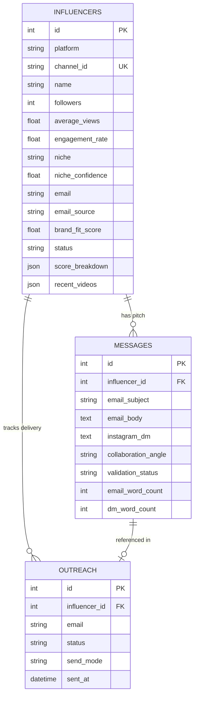

# EDXSO Influencer Outreach System & Next.js CRM

> **Production-Grade Micro-Influencer Discovery, Anti-False-Positive Classification, 100-Point Brand-Fit Scoring, Groq LLM Personalization, and Modern B2B SaaS CRM.**

[](https://www.python.org/)
[](https://fastapi.tiangolo.com/)
[](https://nextjs.org/)
[](https://react.dev/)
[](https://tailwindcss.com/)
[](https://groq.com/)
[](https://www.sqlite.org/)

---

## ⚡ Quick Start (Run in 2 Steps)

### Step 1: Start Backend API (FastAPI)
```bash
# In project root:
pip install -r requirements.txt
python -m uvicorn app.api.server:app --port 8000
```
*Backend runs on `http://localhost:8000` with interactive Swagger docs at `http://localhost:8000/docs`.*

### Step 2: Start Frontend CRM (Next.js)
```bash
cd frontend
npm install
npm run dev
```
*Open **`http://localhost:3000`** in your browser to access the full SaaS CRM interface.*

---

## 📋 Executive Overview & Key Solutions

This project was built for the **EDXSO AI Engineer Intern Assessment**. It provides an end-to-end platform for automated micro-influencer discovery, brand-fit evaluation, AI-generated personalized outreach, and workflow tracking.

```
YouTube Data API v3 (Multi-query Tech Search: Python, AI, React, Cloud, DevOps)
       │
       ▼ (100–120+ Real Candidate Creators)
Anti-False-Positive Filtering (Video Title Ratio & Tech Evidence Audit)
       │
       ▼
100-Point Brand-Fit Rubric (Followers 25, Tech 25, Content 20, Proxy 20, Geo 10)
       │
       ▼
Public Contact Extraction (Zero-Guessing Policy: description / website / Not Found)
       │
       ▼
Groq LLM Structured Personalization (Llama 3.3 70B: 60–90w Email, 15–30w DM)
       │
       ▼
Next.js B2B CRM & Safe Outreach Tracker (Simulated Delivery & Audit Logs)
       │
       └──► Clean CSV Exports: data/exports/ (influencers.csv, messages.csv, outreach.csv)
```

---

## 🎯 How Assessment Challenges Were Solved

### 1. 100+ Discovery & Elimination of False Positives
* **Multi-Query Strategy**: Queries YouTube Data API v3 across 10+ targeted technical queries (*Python programming, React tutorial, web development, AI tools, machine learning, DevOps, cybersecurity, cloud computing*).
* **Anti-False-Positive Video Ratio**: To prevent non-tech creators (e.g. comedy or entertainment channels) from being misclassified, the classifier audits the creator's recent video uploads:
  $$\text{Tech Video Ratio} = \frac{\text{Verified Technology Uploads}}{\text{Total Recent Uploads}}$$
  Channels with $< 30\%$ verified technical videos are automatically down-scored or rejected, eliminating comedy false positives.

### 2. Explainable 100-Point Brand-Fit Rubric
Every creator receives a transparent, auditable score from 0 to 100 based on 5 weighted pillars:

| Pillar | Weight | Scoring Criteria |
| :--- | :---: | :--- |
| **Follower Fit** | 25 pts | 10k–50k: **25 pts** (sweet spot); 5k–10k or 50k–100k: **20 pts**; Outside: **0 pts** |
| **Tech Relevance** | 25 pts | Channel Title (20%) + Description (25%) + Recent Video Titles (40%) + Themes (15%) |
| **Content Relevance** | 20 pts | $\ge 4$ recent technical uploads: **20 pts**; 2–3 uploads: **15 pts**; $< 2$: **10 pts** |
| **Engagement Proxy** | 20 pts | Public $(\text{Likes} + \text{Comments}) / \text{Subs}$: $\ge 3.0\% \to$ **20 pts**; $1.5\text{--}3.0\% \to$ **16 pts**; $<0.5\% \to$ **6 pts** |
| **Geographic Relevance** | 10 pts | Global tech hubs (US, UK, CA, IN, DE, etc.): **10 pts**; Other: **7 pts**; Unset: **5 pts** |

* **Qualification Thresholds**: `QUALIFIED` ($\ge 70$), `REVIEW` ($50\text{--}69$), `REJECTED` ($< 50$).

### 3. Strict Zero-Guessing Email Policy
* **Ethical Data Collection**: Contact emails are extracted exclusively from public YouTube channel descriptions and linked website pages.
* **No Hallucinated Emails**: If no public contact is discovered, the record is marked explicitly as `"Not Found"`. Emails are **never guessed or fabricated**.
* **Source Attribution**: Every email is labeled with its source (`youtube_description`, `creator_website`, `not_found`).

### 4. Groq LLM Personalization with Strict Word-Count Guardrails
* **Contextual Grounding**: Prompts inject actual recent video titles and detected topics to prevent generic boilerplate.
* **Strict Validation Rules**:
  * **Email Body**: Strictly **60–90 words** (concise, high-converting B2B outreach pitch).
  * **Instagram DM**: Strictly **15–30 words** (casual, direct collaboration message).
  * **Placeholder Prevention**: Prohibits placeholder tokens (e.g. `[Your Name]`, `{brand}`).
* **Self-Healing Loop**: If a generated message fails word count or token checks, the engine automatically retries up to 2 times with feedback before flagging for manual review.

### 5. Safe Outreach Simulation Layer
* **Default Mode**: Default `simulation` mode records dry-run timestamps without sending live emails.
* **Decoupled Workflow**: Creators with unlisted emails are marked as `SKIPPED_NO_EMAIL` (ready for manual DM) rather than dropped from the pipeline.
* **Deduplication**: Checks SQLite records to ensure creators are never contacted twice.

---

## 🖥️ Next.js SaaS CRM Interface

The application features a modern **B2B SaaS CRM interface** (inspired by Linear, Attio, and HubSpot):

| View | Route | Key Functionality |
| :--- | :--- | :--- |
| **Executive Dashboard** | `/` | Real-time KPI cards, conversion pipeline bar, top opportunities, and live activity stream. |
| **Influencers CRM** | `/influencers` | Dense data grid with sticky headers, search, niche filters, sorting, bulk actions, and slide-over creator drawer. |
| **Creator Record Drawer** | `/influencers` | Detailed creator metadata strip, contact verification, tech video audit, 100-point rubric breakdown, and editable AI pitch. |
| **AI Personalization Studio** | `/messages` | Split-screen workspace: creator selection list, video evidence context, and editable outreach composer with live word-count badges. |
| **Outreach Tracker** | `/outreach` | Audit logging, duplicate prevention, and slide-over 5-step event timeline for each message. |
| **Pipeline Analytics** | `/analytics` | 6-stage conversion funnel, public email sources breakdown, and niche distributions. |
| **Discovery Workspace** | `/discovery` | Multi-niche trigger panel with live step-by-step checklist and real-time candidate stream. |
| **Settings & APIs** | `/settings` | YouTube and Groq API connection diagnostics, SQLite table stats, and 1-click CSV downloads. |

---

## 🏗️ Architecture & Database Schema



---

## 🛠️ CLI Commands & Pipeline Execution

You can also run the full pipeline or individual stages directly from the command line:

```bash
# 1. Run full end-to-end pipeline (Discovery -> Scoring -> Groq Pitch -> Simulation -> CSV Export)
python main.py pipeline --target 100

# 2. Run individual stages
python main.py discover --target 100   # Stage 1: YouTube Discovery
python main.py filter                  # Stage 2: Niche Classification & 100-Point Scoring
python main.py personalize             # Stage 3: Groq LLM Personalization
python main.py outreach --mode simulation  # Stage 4: Safe Outreach Simulation
python main.py export                  # Stage 5: Export CSVs to data/exports/

# 3. Launch FastAPI backend server
python main.py api --port 8000
```

---

## 🧪 Automated Testing Suite

The test suite runs 100% offline with comprehensive mocks for external APIs:

```bash
pytest -v
```

### Test Coverage Highlights:
* **`test_discovery.py`**: YouTube pagination, subscriber bound filtering ($5\text{k}\text{--}100\text{k}$), quota management.
* **`test_scoring.py`**: 100-point rubric calculation, qualification thresholds (`QUALIFIED`, `REVIEW`, `REJECTED`).
* **`test_filtering.py`**: Deterministic keyword classifier, anti-false-positive video ratios.
* **`test_enrichment.py`**: Email regex extraction, de-obfuscation, zero-guessing enforcement.
* **`test_personalization.py`**: Groq prompt builder, system guardrails, JSON output formatting.
* **`test_validation.py`**: Strict email word count ($60\text{--}90\text{w}$), DM word count ($15\text{--}30\text{w}$), placeholder detection.
* **`test_outreach.py`**: Duplicate outreach prevention, missing email handling, simulation audit logging.

---

## 📦 Generated Datasets & Exports

All exported CSV datasets are automatically written to `data/exports/`:

1. **`data/exports/influencers.csv`**: Full influencer CRM dataset with subscriber metrics, engagement proxy, brand-fit score, 5-pillar score breakdown, verified tech video ratio, and public email source.
2. **`data/exports/messages.csv`**: AI-generated collaboration pitches with subject lines, 60–90 word email bodies, 15–30 word Instagram DMs, word count metrics, and validation statuses.
3. **`data/exports/outreach.csv`**: Outreach audit logs with timestamps, dispatch modes (`simulation` / `smtp` / `manual_dm`), and delivery statuses.

---

## ⚖️ Ethical & Compliance Standards

* **Real YouTube Data**: Discovered creators represent real YouTube channels with authentic public metrics.
* **Strict Privacy Policy**: Only public contact emails from channel descriptions/bios are collected. No guessing, brute-forcing, or private data scraping.
* **Clear Metrics Disclaimer**: Engagement rate is documented as a public video proxy $(\text{Likes}+\text{Comments})/\text{Subs}$, avoiding claims of private creator analytics access.

---

## 📄 License & Assessment Information

* **Project**: EDXSO AI Engineer Intern – Assignment 1
* **Developer**: Shivam
* **License**: MIT License
